# 🍳 Fridgy - Your AI-Powered Kitchen Assistant

**Fridgy** is a full-stack web application designed to reduce food waste. It allows users to manage a virtual pantry and transform available ingredients into professional, step-by-step recipes using the **OpenAI API**.

**Tech Stack:** Spring Boot • React • MySQL • OpenAI API  

---

## 🚀 Key Features

* **Smart Ingredient Selection:** A visual grid interface where users select ingredients to add to their "virtual fridge."
* **AI Recipe Generation:** Integrated **OpenAI API** that generates unique recipes with preparation times and cooking steps.
* **Community Explore:** Discover recipes created by other users.
* **User Accounts & Favorites:** Save favorite AI-generated recipes with secure registration.
* **Review System:** Rate and comment on recipes.
* **Ingredient Suggestion:** Request new ingredients, which are sent to the admin for approval.

---

## 🛡️ Live Admin Dashboard (Admin Only)

The application includes a restricted **Admin Panel** accessible only to Admins:  
* **Live Statistics:** Real-time data on users, recipes, and favorites.  
* **Trending Ingredients:** Track most-used ingredients by the community.  
* **Moderation Tools:** Approve or reject new ingredient requests and manage users.  

---

## 🛠️ Tech & Architecture

### **Backend (Spring Boot - MVC)**
* **Controllers:** Handle API requests.  
* **Services:** Business logic and OpenAI integration.  
* **Repositories:** Interface with MySQL via Spring Data JPA.  
* **Models/Entities:** Define Users, Ingredients, and Recipes.  
* **Spring Security:** Authentication and role-based access.  

### **Frontend (React.js)**
* **Component-Based:** Reusable UI components for consistent design.  
* **Modern UI/UX:** Responsive grid system for ingredient selection.  
* **State Management:** Real-time updates of user input and ingredient lists.  

### **AI & Database**
* **OpenAI API:** Converts ingredient lists into high-quality recipes.  
* **MySQL:** Stores all application data persistently.  

---

## 🧠 System Logic: How it Works

1. **Selection:** Users pick ingredients from the React interface.  
2. **Request:** Data is sent to the **Controller** and passed to the **Service**.  
3. **AI Integration:** Service builds a prompt and calls the **OpenAI API**.  
4. **Live Updates:** Saved recipes update Admin Dashboard statistics in real-time.  

---

## 📸 Screenshots

### 👤 User Experience
| Home & Landing | How it Works |
| :--- | :--- |
| 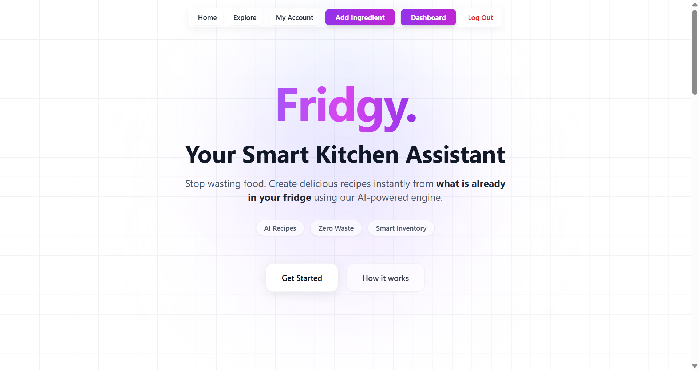 | 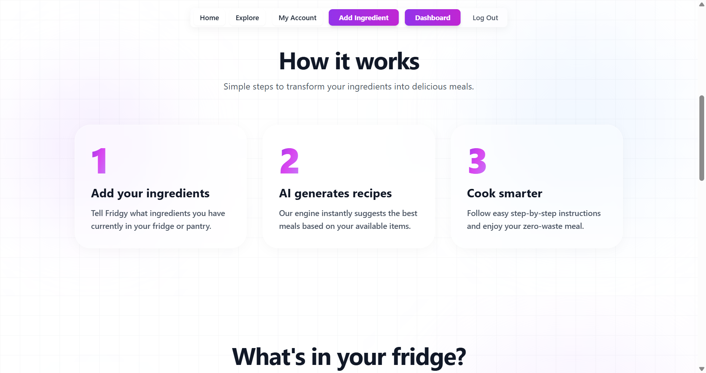 |

| Ingredient Selection | AI Recipe Output |
| :--- | :--- |
| 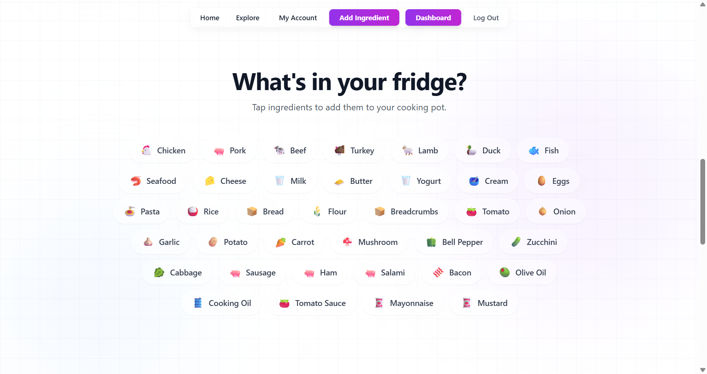 | 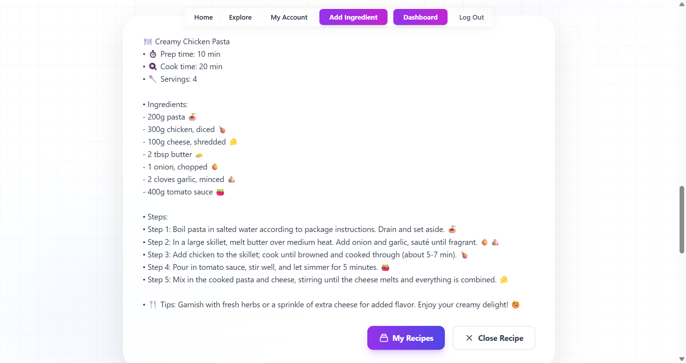 |

### 🛡️ Live Admin Panel
| Real-time Statistics | Ingredient Moderation |
| :--- | :--- |
| 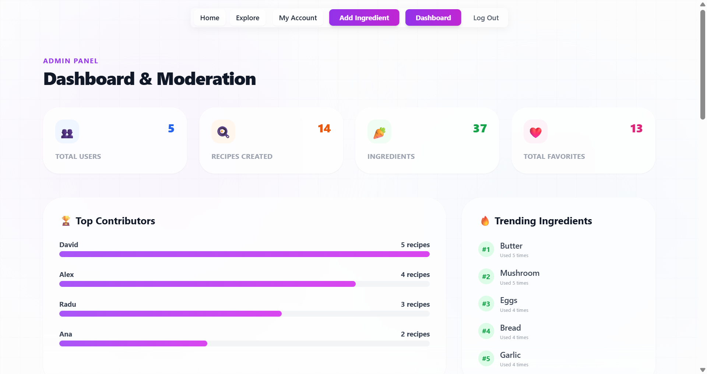 | 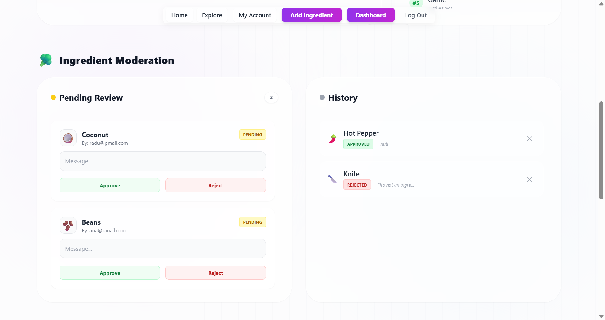 |

| User Database | New Ingredient Request |
| :--- | :--- |
| 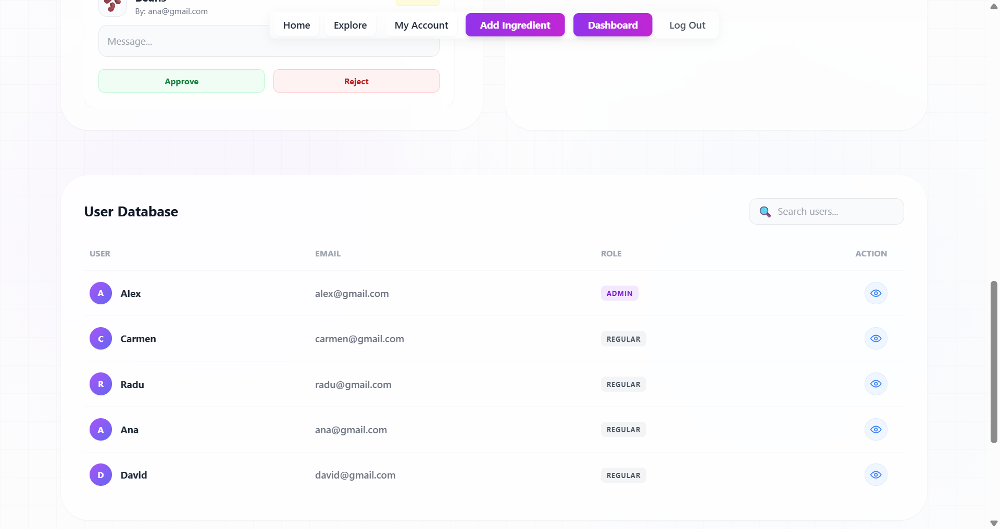 | 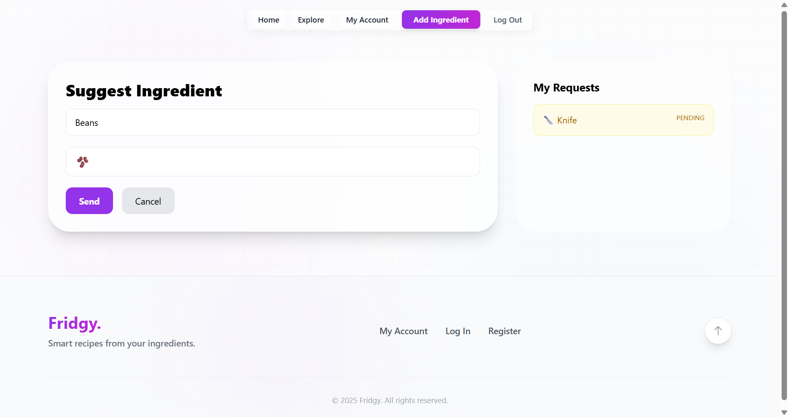 |

### 🔐 Community & Auth
| Community Feed | Reviews & Feedback |
| :--- | :--- |
| 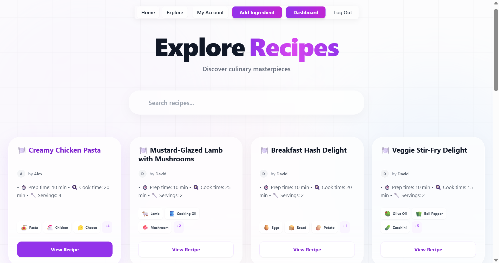 | 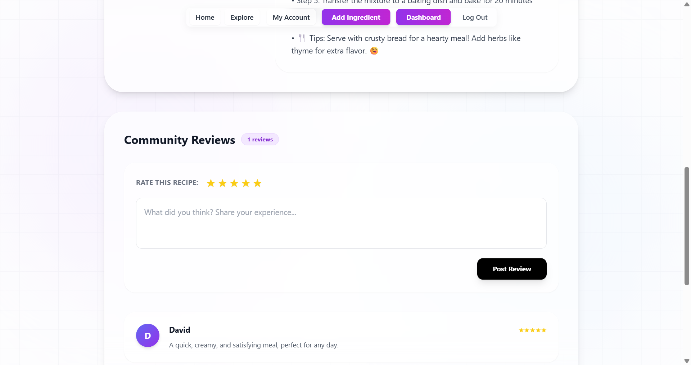 |

| Login Interface | User Profile |
| :--- | :--- |
| 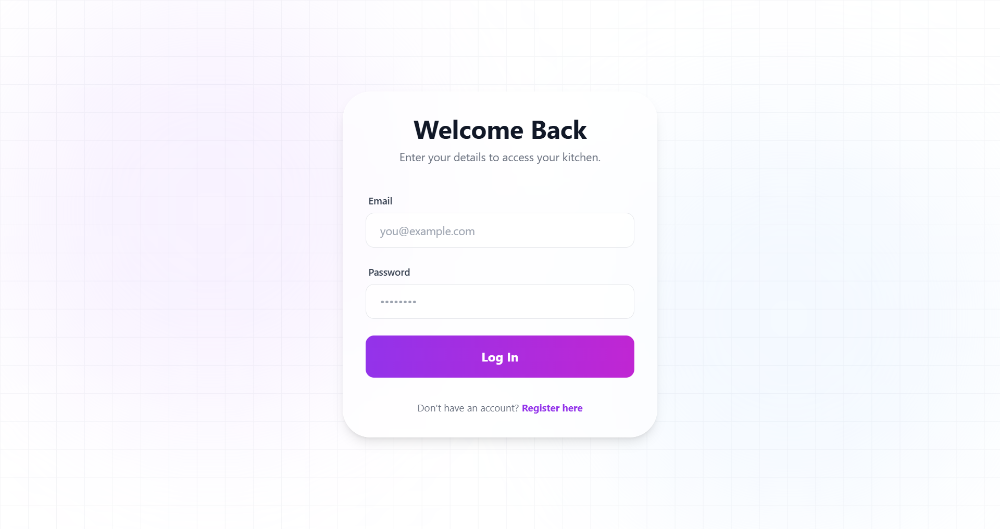 | 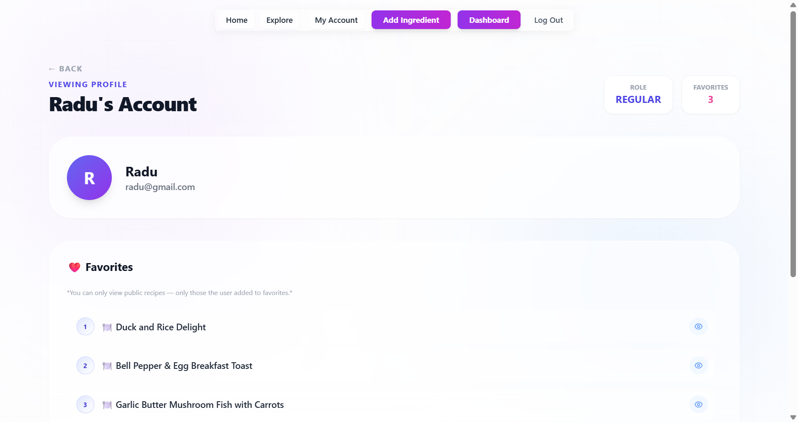 |

© 2025 Fridgy - Smart recipes from your ingredients.
